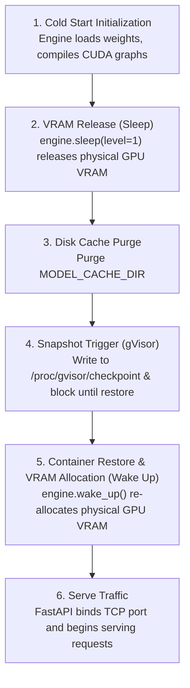

# GKE Fast Pod Snapshot Utility for vLLM

A modular container snapshot provider and vLLM lifespan wrapper that enables fast pod checkpointing and restoration on Google Kubernetes Engine (GKE) with GKE Sandbox (gVisor) and NVIDIA GPUs.

---

## Overview

Deploying large language models (LLMs) on Kubernetes often incurs high cold-start latencies due to downloading weights, loading them into memory, allocating GPU VRAM, and compiling CUDA graphs.

This package provides a drop-in launcher and snapshot provider that hooks into vLLM's FastAPI application lifespan to:
1. Initialize the vLLM engine and compile CUDA graphs during container cold start.
2. Put the vLLM engine to sleep (`engine.sleep(level=1)`) to release physical GPU VRAM while preserving virtual memory mappings.
3. Purge cached model weight files from disk to minimize the checkpoint storage footprint.
4. Trigger a gVisor userspace checkpoint via `/proc/gvisor/checkpoint`.
5. Restore the container and wake up the engine (`engine.wake_up()`) to re-allocate physical GPU VRAM upon restoration before binding HTTP ports and serving traffic.

> [!NOTE]
> This README is intended for developers maintaining and integrating this snapshot utility. A comprehensive user guide for deployment, cluster configuration, and end-to-end benchmark walkthroughs is upcoming in the [`/guides`](../../../guides) directory.

---

## Architecture & Lifecycle

The snapshot lifecycle is orchestrated inside the FastAPI application lifespan context manager ([`vllm/wrapper.py`](vllm/wrapper.py)):



---

## Package Layout & Components

```
docker/scripts/snapshot/
├── __init__.py           # Package exports (GKESnapshotProvider, patch_vllm_lifespan, get_snapshot_provider)
├── launcher.py           # CLI entrypoint wrapping vllm serve
├── providers.py          # GKESnapshotProvider and provider factory
├── test_providers.py     # Unit test suite
├── README.md             # Developer documentation
└── vllm/
    ├── __init__.py       # vLLM integration exports
    └── wrapper.py        # FastAPI lifespan context manager patch
```

### Component Details

- **[`launcher.py`](launcher.py)**:
  CLI entrypoint intended to replace `vllm serve` or `python3 -m vllm.entrypoints.openai.api_server`. It dynamically intercepts `vllm.entrypoints.openai.api_server.build_app` to apply `patch_vllm_lifespan()` to the FastAPI application before passing control to `vllm.entrypoints.cli.main()`.

- **[`vllm/wrapper.py`](vllm/wrapper.py) (`patch_vllm_lifespan`)**:
  Wraps the FastAPI application's `router.lifespan_context`. During startup, after the original lifespan context initializes the vLLM engine:
  - Calls `await engine.sleep(level=1)` to release physical GPU memory.
  - Calls `snapshot_provider.trigger()` in a separate thread.
  - Upon process resumption, calls `await engine.wake_up()` to restore GPU memory mappings.
  - Resumes the lifespan lifecycle, allowing Uvicorn to bind TCP ports.

- **[`providers.py`](providers.py) (`GKESnapshotProvider`)**:
  Handles the low-level interaction with gVisor's `/proc/gvisor/checkpoint` interface:
  - `clear_cache()`: Recursively deletes downloaded model weight files from `MODEL_CACHE_DIR` to reduce checkpoint size.
  - `is_available()`: Checks if the procfs checkpoint trigger file is writable.
  - `trigger()`: Clears the cache, opens `/proc/gvisor/checkpoint`, writes `1` to initiate checkpointing, and blocks on a 1-byte read until the container is restored.

- **[`providers.py`](providers.py) (`get_snapshot_provider`)**:
  Factory function that returns a `GKESnapshotProvider` if `SNAPSHOT_PROVIDER=gke_gvisor`, or `None` if unset/disabled.

---

## Running Unit Tests

Run the test suite locally using Python's standard `unittest` runner or `pytest`:

```bash
python3 -m unittest docker/scripts/snapshot/test_providers.py
```

Or:

```bash
pytest docker/scripts/snapshot/test_providers.py
```

> [!NOTE]
> Unit tests are also automatically executed in CI/CD via [`.github/workflows/ci-pr-checks.yaml`](../../../.github/workflows/ci-pr-checks.yaml).
