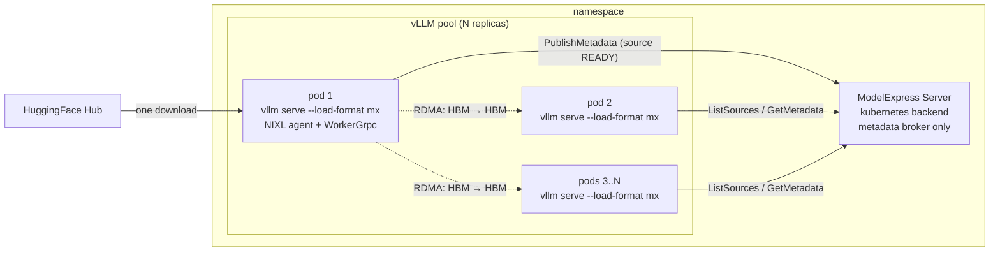

# ModelExpress P2P Weight Transfer

## Overview

This guide adds [NVIDIA ModelExpress](https://github.com/ai-dynamo/modelexpress) to the [Optimized Baseline](../optimized-baseline/README.md) deployment. It moves cold-start weight loading off disk and onto **GPU-to-GPU NIXL/RDMA**. One pod in the inference pool loads weights from HuggingFace. Every other pod gets the same weights directly from that pod's HBM over the RDMA fabric, and none of them touch disk.

A central-coordinator ModelExpress server (it runs with the `kubernetes` metadata backend) brokers the metadata exchange. It tracks which pods are READY sources for which `mx_source_id`, and gives target pods the NIXL agent and tensor-manifest endpoints they need to start an RDMA pull. The server itself never touches weight bytes.

For an `N`-replica deployment of `openai/gpt-oss-120b` (~61 GB of MXFP4 weights):

* Without ModelExpress, every vLLM pod pulls ~61 GB from HuggingFace at startup: N times the cluster egress, N times the slow path, plus disk-to-GPU load time on every pod.
* With this guide, the first pod to come up does the HuggingFace download, registers its tensors with NIXL, and publishes itself as a P2P source. Every other pod finds that source through the ModelExpress server and pulls weights straight into GPU HBM over RDMA.

> This guide ships a default of **2 replicas (1 seed + 1 receiver)** to keep the GPU footprint small (4 GPUs at TP2), and it still runs a real HBM-to-HBM transfer. The amount of weight data moved over P2P grows with `(bytes per replica) x (number of receivers)`. Scale the pool wider to see a production fan-out. See [measuring-storage-paths](./measuring-storage-paths.md) to record P2P and storage-backed load times in your own environment.



### When to use this guide

Use P2P weight transfer when:

* Your inference pool has multiple replicas of the same model checkpoint.
* You have an InfiniBand, RoCE, or EFA fabric exposed to pods — either as the `rdma/ib` extended resource via a device plugin (the `coreweave` overlay, see Step 3), or through DRA on GKE (the `gke` overlay).
* You care about cold-start tail latency on scale-outs, rolling restarts, or live-refit workloads where many pods come up close together.

For workload-specific guidance (RL training rollouts, elastic bin-packed racks), see the [workload notes](./compile-cache.md#workload-notes).

## Default Configuration

| Component | Value |
| --- | --- |
| Model | [openai/gpt-oss-120b](https://huggingface.co/openai/gpt-oss-120b) (~61 GB, MXFP4, ungated) |
| Replicas | 2 (1 seed + 1 receiver; scale wider for a real fan-out) |
| Tensor Parallelism | 2 |
| Total GPUs | 4 |
| Fabric resource | `rdma/ib` (2 per pod, via the `coreweave` overlay), or GKE DRA `mrdma` claims (via the `gke` overlay) |
| Image | Shared GPU vLLM image + ModelExpress client baked in (build it yourself, see [Image](#image-building-a-modelexpress-enabled-model-server-image)) |
| MX backend | `kubernetes` (CRDs, no Redis) |
| Weight transport | NIXL/RDMA, GPU HBM -> GPU HBM |

## Prerequisites

* Install the [required client tools on your local system](../../helpers/client-setup/README.md) to use this guide.
* Use a Kubernetes cluster with RDMA-capable GPU nodes (H100/H200). Fabric access comes either from a device plugin that exposes `rdma/ib` (the `coreweave` overlay; adjust the resource name for your fabric's equivalent, see Step 3), or on GKE from GPU DRA + DRANet (the `gke` overlay) — to pre-provision a GKE cluster with DRA & RDMA/RoCE, follow the [same setup as the P/D guide](../pd-disaggregation/README.md#gke-cluster-pre-provisioning-with-dra--rdmaroce).

* Checkout llm-d repo:

<!-- guide:prerequisites.clone start -->
<!-- llm-d-cicd:skip start -->
```bash
git clone https://github.com/llm-d/llm-d.git && cd llm-d && git checkout ${BRANCH}
```
<!-- llm-d-cicd:skip end -->
<!-- guide:prerequisites.clone end -->

* Set the guide specific environment variables:

<!-- guide:env.static start -->
```bash
export BRANCH=main
export REPO_ROOT=$(realpath $(git rev-parse --show-toplevel))
export GUIDE_NAME=modelexpress-p2p
export NAMESPACE=llm-d-modelexpress-p2p
export MX_VERSION=v0.5.0
```
<!-- llm-d-cicd:skip start -->
```bash
export HF_TOKEN=HF_TOKEN_PLACEHOLDER
```
<!-- llm-d-cicd:skip end -->
```bash
export MODEL=openai/gpt-oss-120b
export PROVIDER_NAME=gke # options: none, gke, agentgateway, istio
export INFRA_PROVIDER=coreweave # options: base, coreweave, gke
export CURL_TEST_IMAGE=cfmanteiga/alpine-bash-curl-jq:latest
```
<!-- guide:env.static end -->

> [!NOTE]
> `HF_TOKEN` must be a [valid HuggingFace token](../../helpers/hf-token.md). Replace
`HF_TOKEN_PLACEHOLDER` with your real token.

* Source the common guide environment variables:

<!-- guide:env.source start -->
```bash
source ${REPO_ROOT}/guides/env.sh
```
<!-- guide:env.source end -->

* Install the Gateway API Inference Extension CRDs:

<!-- guide:prerequisites.gaie start -->
```bash
# GAIE_URL is automatically calculated from GAIE_VERSION at ${REPO_ROOT}/guides/env.sh
kubectl apply -f https://github.com/kubernetes-sigs/gateway-api-inference-extension/${GAIE_URL}/v1-manifests.yaml
```
<!-- guide:prerequisites.gaie end -->

* Create the target namespace:

<!-- guide:prerequisites.namespace start -->
```bash
kubectl create namespace ${NAMESPACE} --dry-run=client -o yaml | kubectl apply -f -
```
<!-- guide:prerequisites.namespace end -->

* A cluster admin installs the ModelExpress CRDs cluster-wide (one-time step). The apply pins the upstream `v0.5.0` tag so the CRD shape stays locked to the `modelexpress-server:0.5.0` pin instead of drifting with upstream `main`:

<!-- guide:prerequisites.crds start -->
```bash
kubectl apply -f https://raw.githubusercontent.com/ai-dynamo/modelexpress/${MX_VERSION}/examples/crds.yaml
```
<!-- guide:prerequisites.crds end -->

* Create an `nvcr-imagepullsecret` in the target namespace to grant access to `nvcr.io/nvidia/ai-dynamo/modelexpress-server`. See the [ModelExpress Helm README](https://github.com/ai-dynamo/modelexpress/blob/v0.5.0/helm/README.md#1-create-nvidia-container-registry-secret) for the secret recipe. Or build this image yourself and push it to a local registry of your choice.
* [Create the `llm-d-hf-token` secret in your target namespace with the key `HF_TOKEN` matching a valid HuggingFace token](../../helpers/hf-token.md). `gpt-oss-120b` is ungated, but the token avoids HF rate limits on the seed download, and the gated Llama checkpoint in [measuring-storage-paths](./measuring-storage-paths.md) needs it:

<!-- guide:prerequisites.secrets start -->
<!-- llm-d-cicd:skip start -->
```bash
kubectl create secret generic llm-d-hf-token \
  --from-literal="HF_TOKEN=${HF_TOKEN}" \
  --namespace "${NAMESPACE}" \
  --dry-run=client -o yaml | kubectl apply -f -
```
<!-- llm-d-cicd:skip end -->
<!-- guide:prerequisites.secrets end -->

### Image: building a ModelExpress-enabled model server image

The `mx` load format comes from the [`modelexpress` Python client](https://github.com/ai-dynamo/modelexpress/tree/main/modelexpress_client/python), a vLLM plugin. Build a thin derived image on top of the shared GPU vLLM image from `guides/recipes/modelserver/components/images/gpu-vllm`. This way, the guide tracks the project default when that component changes.

> [!WARNING]
> The shared GPU vLLM image does not ship the ModelExpress client. You need an image with the client baked in. This Dockerfile follows the pattern of the upstream [ModelExpress client Dockerfile](https://github.com/ai-dynamo/modelexpress/blob/v0.5.0/examples/p2p_transfer_k8s/client/vllm/Dockerfile), but takes its base image from the central llm-d image component:

```dockerfile
# guides/modelexpress-p2p/image/Dockerfile
ARG BASE_IMAGE
FROM ${BASE_IMAGE}

# `--no-deps` keeps the client from shadowing the image's pinned
# vllm / torch / nixl, so its remaining deps must be listed explicitly:
# google-crc32c (artifact chunk checksums) is not in the vLLM base image.
# The 0.5.x wheels ship a prebuilt VMM allocator extension; no build step.
ARG MODELEXPRESS_VERSION=0.5.0
ARG GOOGLE_CRC32C_VERSION=1.8.0
RUN python3 -m pip install --target=/opt/modelexpress --no-deps --no-cache-dir \
        "modelexpress==${MODELEXPRESS_VERSION}" \
        "google-crc32c==${GOOGLE_CRC32C_VERSION}"
ENV PYTHONPATH=/opt/modelexpress
```

Build it and push to a registry your cluster can pull from:

```bash
export BASE_MODELSERVER_IMAGE=$(
  yq -r '.images[] | select(.name == "REPLACE_MODEL_SERVER_IMAGE") | "\(.newName):\(.newTag)"' \
    ${REPO_ROOT}/guides/recipes/modelserver/components/images/gpu-vllm/kustomization.yaml
)
export MODELSERVER_IMAGE=<your-registry>/modelexpress-p2p-vllm:latest
docker build \
  --build-arg "BASE_IMAGE=${BASE_MODELSERVER_IMAGE}" \
  -t "${MODELSERVER_IMAGE}" \
  ${REPO_ROOT}/guides/${GUIDE_NAME}/image/
docker push "${MODELSERVER_IMAGE}"
```

Then point the model-server overlay at it (the overlay ships a `<your-registry>/...` placeholder):

```bash
cd ${REPO_ROOT}/guides/${GUIDE_NAME}/modelserver/gpu/vllm/base
kustomize edit set image REPLACE_MODEL_SERVER_IMAGE=${MODELSERVER_IMAGE}
cd -
```

vLLM 0.23.0 and newer recognize `--load-format modelexpress` natively once the client package is installed. The `VLLM_PLUGINS=modelexpress` env in `patch-vllm.yaml` is only needed for older vLLM bases and is harmless on newer ones.

> The 0.5.0 client keeps `mx` as a backward-compatible alias for the canonical `modelexpress` load format. This guide uses `--load-format=mx`. Both work.

## Installation Instructions

### 1. Deploy the ModelExpress Server

This step provisions the `kubernetes`-backend ModelExpress server, RBAC for the `ModelMetadata` and `ModelCacheEntry` CRDs, and a `modelexpress-server` Service. The inference pods find this Service through DNS.

<!-- guide:deploy.mx_server start -->
```bash
kubectl apply -n ${NAMESPACE} -f ${REPO_ROOT}/guides/${GUIDE_NAME}/modelexpress/modelexpress-server.yaml
kubectl rollout status -n ${NAMESPACE} deploy/modelexpress-server --timeout=5m
```
<!-- guide:deploy.mx_server end -->

### 2. Deploy the llm-d Router

#### Standalone Mode

<!-- guide:deploy.standalone start -->
```bash
helm install ${GUIDE_NAME} \
  ${ROUTER_STANDALONE_CHART} \
  -f ${REPO_ROOT}/guides/recipes/router/base.values.yaml \
  -f ${REPO_ROOT}/guides/${GUIDE_NAME}/router/${GUIDE_NAME}.values.yaml \
  -n ${NAMESPACE} --version ${ROUTER_CHART_VERSION}
```
<!-- guide:deploy.standalone end -->

<details>
<summary><b>Gateway Mode</b></summary>

To use a Kubernetes Gateway managed proxy instead of the standalone version, follow these steps instead of applying the previous Helm chart:

1. _Deploy a Kubernetes Gateway_ by following one of [the gateway guides](../../docs/infrastructure/gateway).
2. _Deploy the llm-d router and an HTTPRoute_ that connects it to the Gateway as follows:

<!-- guide:deploy.gateway start -->
```bash
helm install ${GUIDE_NAME} \
  ${ROUTER_GATEWAY_CHART} \
  -f ${REPO_ROOT}/guides/recipes/router/base.values.yaml \
  -f ${REPO_ROOT}/guides/${GUIDE_NAME}/router/${GUIDE_NAME}.values.yaml \
  --set provider.name=${PROVIDER_NAME} \
  --set httpRoute.create=true \
  --set httpRoute.inferenceGatewayName=llm-d-inference-gateway \
  -n ${NAMESPACE} --version ${ROUTER_CHART_VERSION}
```
<!-- guide:deploy.gateway end -->

</details>

### 3. Deploy the Model Server

> [!IMPORTANT]
> This step needs the image you built in [the prerequisites](#image-building-a-modelexpress-enabled-model-server-image). The overlay ships a `<your-registry>/...` placeholder that will not pull as-is.

The base overlay leaves fabric resources unset. `INFRA_PROVIDER` (set in the environment variables above) picks the provider overlay that matches how your cluster exposes RDMA NICs to pods:

<!-- guide:deploy.modelserver start -->
```bash
kubectl apply -n ${NAMESPACE} -k ${REPO_ROOT}/guides/${GUIDE_NAME}/modelserver/gpu/vllm/${INFRA_PROVIDER}/
```
<!-- guide:deploy.modelserver end -->

| Overlay | What it adds |
| --- | --- |
| `base` | Nothing fabric-specific. Use only if your CNI auto-injects RDMA devices, or for a non-RDMA dry run where P2P falls back to host networking. |
| `coreweave` | `rdma/ib: 2` extended-resource request per pod (matches CoreWeave, OpenShift k8s-rdma-shared-dev-plugin, and most stock IB device-plugin setups). |
| `gke` | GKE A3 Ultra (H200 + RoCE): GPU DRA + DRANet claims in place of the `nvidia.com/gpu` extended resource, plus the UCX settings for GKE's rail fabric. |

If your cluster uses a different fabric resource (`rdma/roce`, `vpc.amazonaws.com/efa`, and so on), see [Notes & Trade-offs](#notes--trade-offs) for how to adapt the overlay (and the `MX_NIXL_BACKEND=LIBFABRIC` override for EFA).

> [!WARNING]
> The `coreweave` overlay requests the `rdma/ib` extended resource. On a cluster that does not expose it, pods stay `Pending` with no obvious cause. Use the `base` overlay there instead.

One pod comes up first: the bootstrap source, the one downloading from HuggingFace. The rest follow within seconds once that pod publishes itself as READY. To watch the handoff:

```bash
kubectl get pods -n ${NAMESPACE} -l llm-d.ai/guide=modelexpress-p2p -w
```

To confirm P2P actually happened, tail the ModelExpress server log. Look for `source_id ... is READY` followed by a burst of `GetMetadata` calls from the receiver pods:

```bash
kubectl logs -n ${NAMESPACE} deploy/modelexpress-server -f
```

You can also inspect the CRDs directly. The CRD does not expose a printer column for readiness. Use a jsonpath query to see which workers are Ready:

```bash
kubectl get modelmetadata -n ${NAMESPACE} \
    -o jsonpath='{range .items[*]}{.metadata.name}{"\t"}{.status.worker.workerRank}{"\t"}{.status.conditions[?(@.type=="Ready")].status}{"\n"}{end}'
```

### 4. (Optional) Enable monitoring

* Install the [Monitoring stack](../../docs/operations/observability/setup.md).
* To enable Prometheus monitoring on the llm-d router, add `-f ${REPO_ROOT}/guides/recipes/router/features/monitoring.values.yaml` during the [router installation step](#2-deploy-the-llm-d-router).

The monitoring kustomize is a `kind: Component`, so you cannot apply it standalone with `kubectl apply -k`. Layer it into your overlay's `kustomization.yaml` instead (same pattern as the [shared-compile-cache component](./compile-cache.md#option-b-shared-rwx-pvc)):

```yaml
# guides/modelexpress-p2p/modelserver/gpu/vllm/coreweave/kustomization.yaml
components:
  - ../../../../../recipes/modelserver/components/monitoring
```

Then re-apply the overlay (Step 3).

## Verification

### 1. Get the IP of the Proxy

#### Standalone Mode

<!-- guide:verify.endpoint.standalone start -->
```bash
export IP=$(kubectl get service ${GUIDE_NAME}-epp -n ${NAMESPACE} -o jsonpath='{.spec.clusterIP}')
```
<!-- guide:verify.endpoint.standalone end -->

<details>
<summary><b>Gateway Mode</b></summary>

<!-- guide:verify.endpoint.gateway start -->
```bash
export IP=$(kubectl get gateway llm-d-inference-gateway -n ${NAMESPACE} -o jsonpath='{.status.addresses[0].value}')
```
<!-- guide:verify.endpoint.gateway end -->

</details>

### 2. Send Test Requests

<!-- guide:verify.tests start -->
```bash
kubectl run curl-test --rm -i --restart=Never \
  --image=${CURL_TEST_IMAGE} \
  --namespace="${NAMESPACE}" \
  --env="IP=${IP}" \
  --env="MODEL=${MODEL}" \
  -- /bin/sh -c 'curl -sS -X POST "http://${IP}/v1/completions" -H "Content-Type: application/json" -d "{\"model\": \"${MODEL}\", \"prompt\": \"How are you today?\"}"'
```
<!-- guide:verify.tests end -->

## Verify P2P Weight Transfer During Scale-Out

The most direct way to verify P2P weight transfer is to bring the pool up one pod at a time. Each new receiver pod should find a READY source and load model weights directly from that peer.

### 1. Start with a single replica (the bootstrap source)

The default overlay deploys 2 replicas. Scale down to one so you can watch the P2P handoff in isolation. If you have not deployed the pool yet, skip this step. Instead, edit `base/patch-vllm.yaml` to set `replicas: 1` before the initial apply.

```bash
kubectl scale deploy -n ${NAMESPACE} \
    -l llm-d.ai/guide=modelexpress-p2p,llm-d.ai/role=decode \
    --replicas=1
```

Wait for the single seed pod to download from HuggingFace, load weights, register tensors with NIXL, and publish itself as a P2P source:

```bash
kubectl wait pod -n ${NAMESPACE} \
    -l llm-d.ai/guide=modelexpress-p2p \
    --for=condition=Ready --timeout=30m
```

Confirm the source actually published:

```bash
kubectl get modelmetadata -n ${NAMESPACE} \
    -o jsonpath='{range .items[*]}{.metadata.name}{"\t"}{.status.worker.workerRank}{"\t"}{.status.conditions[?(@.type=="Ready")].status}{"\n"}{end}'
# expect one row per TP rank, status column reading "True"
```

For gpt-oss-120b (~61 GB) on a typical cluster, expect this step to take **several minutes**, bounded by HuggingFace bandwidth and disk write throughput.

### 2. Scale up and watch the rest of the pool come up via RDMA

Run the following commands to scale up the deployment and record the load time:

```bash
DECODE=modelexpress-p2p-nvidia-gpu-vllm-decode  # namePrefixed deployment
T0=$(date +%s)
kubectl scale deploy/${DECODE} -n ${NAMESPACE} --replicas=2

kubectl rollout status deploy/${DECODE} -n ${NAMESPACE} --timeout=10m
T1=$(date +%s)
echo "pool reached Ready in $((T1 - T0))s"
```

After scale-up, check the receiver logs for `Transfer complete: ... GB in Xs (... Gbps)`. The environment used to validate this guide observed about 1 second per TP shard on H100/H200 + InfiniBand, but your results depend on model size, fabric, placement, and vLLM settings. End-to-end pod-Ready time also includes vLLM engine init and cudagraph capture. Record both the per-pod weight-transfer line and the `T1 - T0` wall clock if you plan to compare local runs.

### 3. Inspect the RDMA path

Tail the ModelExpress server log during the scale-out. You should see a burst of `GetMetadata` calls from the new pods right after the scale event:

```bash
kubectl logs -n ${NAMESPACE} deploy/modelexpress-server -f
```

Check a receiver pod's vLLM log for the P2P handshake:

```bash
# Newest pod = the receiver, assuming the scale-out flow (the source is
# already running). On a cold N-replica apply the newest pod might be the
# source instead, so prefer the scale-from-1 path above.
RECEIVER=$(kubectl get pods -n ${NAMESPACE} -l llm-d.ai/guide=modelexpress-p2p \
    --sort-by=.metadata.creationTimestamp -o jsonpath='{.items[-1].metadata.name}')
kubectl logs -n ${NAMESPACE} ${RECEIVER} -c modelserver | grep -i -E "mx|nixl|source_id"
```

Look for lines like `discovered READY source` followed by NIXL transfer progress. If you see `falling back to disk load`, RDMA is not reaching the pod. Check the fabric resource request in your `INFRA_PROVIDER` overlay.

## Example Results

Example observation with the guide's default configuration (`openai/gpt-oss-120b`, TP2, 33.51 GB of materialized MXFP4 weights per TP rank, 8×H200 nodes with per-GPU InfiniBand NICs, seed and receiver on separate nodes), 2026-08:

| Path | Weight-load time per rank | Effective rate |
| --- | --- | --- |
| Default loader ← warm NFS RWX PVC | 30.3 s | ~1.1 GB/s |
| ModelExpress P2P | **0.93 s** | ~287 Gbps (~36 GB/s) |
| fastsafetensors | n/a | cannot load MXFP4 |

On GKE A3 Ultra (H200 + RoCE, `gke` overlay, seed and receiver on separate nodes), the same default configuration observed **0.70 s / ~382 Gbps** per TP rank for the P2P weight transfer; see [the GKE report](./benchmark-results/gke-a3u-roce-gpt-oss-120b.md).

With [P2P cache artifact transfer](./compile-cache.md) also enabled, the receiver reuses the seed's 148 MiB torch.compile bundle (installed in 0.9 s): `torch.compile` drops from 20.1 s to 3.4 s and receiver pod-Ready time from 181 s to 156 s. Cudagraph capture is per-pod and remains the largest fixed cost.

These are environment-specific observations, not official NVIDIA benchmark results. Full methodology and tables are in [benchmark-results](./benchmark-results/h200-ib-gpt-oss-120b.md); an earlier dense + MoE comparison (Llama-3.3-70B, Llama-4-Scout, including storage-path caveats) is in [this report](./benchmark-results/coreweave-h200-llama-3.3-70b.md). Reproduce the storage rows with [measuring-storage-paths](./measuring-storage-paths.md).

## Going Further

* [Measuring storage-backed loading paths](./measuring-storage-paths.md): time fastsafetensors from NFS and local NVMe against P2P in your own cluster.
* [Reusing JIT compile caches across pods](./compile-cache.md): once weight transfer is sub-second, cut the `torch.compile` cost with P2P artifact transfer (0.5.0+, measured 20.1 s → 3.4 s) or a shared RWX PVC.
* [Locking down the metadata broker](./security.md): Istio mTLS plus an AuthorizationPolicy for shared clusters.

## Cleanup

<!-- guide:cleanup start -->
```bash
helm uninstall ${GUIDE_NAME} -n ${NAMESPACE}

kubectl delete -n ${NAMESPACE} -k ${REPO_ROOT}/guides/${GUIDE_NAME}/modelserver/gpu/vllm/${INFRA_PROVIDER}/

kubectl delete -n ${NAMESPACE} -f ${REPO_ROOT}/guides/${GUIDE_NAME}/modelexpress/modelexpress-server.yaml

# If you applied the Istio hardening, remove the policies (and the ns label):
kubectl delete -n ${NAMESPACE} -f ${REPO_ROOT}/guides/${GUIDE_NAME}/security/istio-mtls-authz.yaml --ignore-not-found
kubectl label namespace ${NAMESPACE} istio-injection- 2>/dev/null || true

# If you ran the storage-backed measurement workloads, delete those overlays and the prewarm Job:
kubectl delete -n ${NAMESPACE} -k ${REPO_ROOT}/guides/${GUIDE_NAME}/modelserver/gpu/vllm/fastsafetensors-nfs/ --ignore-not-found
kubectl delete -n ${NAMESPACE} -k ${REPO_ROOT}/guides/${GUIDE_NAME}/modelserver/gpu/vllm/fastsafetensors-localnvme/ --ignore-not-found
kubectl delete -n ${NAMESPACE} -k ${REPO_ROOT}/guides/${GUIDE_NAME}/modelserver/gpu/vllm/fastsafetensors-prewarm/ --ignore-not-found

# Deleting the namespace removes the PVC objects too, but on a Retain-policy
# StorageClass the backing volume is NOT reclaimed. Delete PVCs first if you
# want the underlying NFS volume released:
kubectl delete pvc vllm-compile-cache fst-model-cache -n ${NAMESPACE} --ignore-not-found
kubectl delete namespace ${NAMESPACE}
```
<!-- guide:cleanup end -->

### Optional cleanup: remove the shared CRDs

Only do this if no other namespace in the cluster is running ModelExpress. Deleting the CRDs cascade-deletes every `ModelMetadata` and `ModelCacheEntry` object across all namespaces.

```bash
kubectl delete -f https://raw.githubusercontent.com/ai-dynamo/modelexpress/${MX_VERSION}/examples/crds.yaml
```

## Notes & Trade-offs

* RDMA resource name: the `coreweave` overlay (`coreweave/kustomization.yaml`) injects the `rdma/ib: 2` request through a JSON6902 patch; it is _not_ in `base/patch-vllm.yaml`. On clusters with a different device-plugin resource (`rdma/roce`, `vpc.amazonaws.com/efa`, GKE's GPUDirect-TCPXO, and so on), copy that overlay, change the resource name in its patch, and set `MX_NIXL_BACKEND=LIBFABRIC` for EFA.
* NIC pinning: `MX_RDMA_NIC_PIN=auto` runs ModelExpress's topology probe to pin each rank to the IB NIC closest to its GPU. This is a workaround for [openucx/ucx#11259](https://github.com/openucx/ucx/issues/11259). Override it with a comma-separated NIC list if the auto-probe picks wrong, or set `MX_RDMA_NIC_PIN_MIN_RATE_GBPS` to raise the rate threshold the probe uses to discard slow NICs.
* Fixed metadata/worker ports: `MX_METADATA_PORT` (default `5555`) and `MX_WORKER_GRPC_PORT` are _base_ ports; each TP rank uses `base + device_id`. With TP=2, each pod uses `5555..5556` and `6555..6556`. If you change TP size, make sure the port range stays free and the values match across pods.
* Mixed-version fleets: the kubernetes backend indexes by `mx_source_id`, which is content-addressed through `SourceIdentity.revision`. Multiple revisions of the model can coexist in the same namespace. Pods only consume from sources that match their identity.
* No shared storage on the P2P test: it deliberately uses per-pod `emptyDir` model caches. The seed pod fills its local cache, but receivers never touch theirs. Weights land straight in HBM through RDMA.
